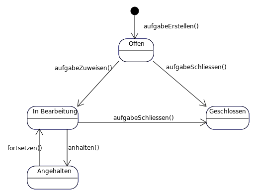

================
Benutzerhandbuch
================

Teamhub bietet einfaches Aufgabenmanagement für kleine Teams. Sie können Aufgaben erstellen, mit Beschreibungen versehen und sie Teammitgliedern zuweisen. Aufgaben werden in Projekten organisiert, so dass mehrere Teams an unterschiedlichen Projekten arbeiten können.

Rollen
======

In Teamhub können Benutzerkonten eine von zwei Rollen annehmen, Benutzer oder Teamleiter.

Benutzer
--------

Benutzer dürfen

* Aufgaben erstellen und bearbeiten
* Kommentare erstellen
* Ihr Benutzerprofil bearbeiten

Teamleiter
----------
Teamleiter haben alle Privilegien der Benutzerrolle. Zusätzlich können Teamleiter

* Projekte erstellen und bearbeiten
* Benutzerkonten erstellen und bearbeiten
* Passwörter anderer Benutzer zurücksetzen

Projekte
========

Projekte dienen der Organisation von Aufgaben. Sie können nur von Teamleitern erstellt werden.

Projekt erstellen
-----------------

Wählen Sie aus den Admin-Tools am oberen Bildschirmrand "Projekt erstellen" und füllen das erscheinende Formular aus.

Projekt bearbeiten
------------------

Wählen Sie aus der Menüleiste am oberen Bildschirmrand "Projekte" und anschließend das Projekt aus der erscheinenden Liste, das Sie bearbeiten möchten. In der folgenden Detailansicht können Sie das Projekt betrachten. Oberhalb des Projekttitels finden Sie die Schaltfläche "Projekt bearbeiten" mit der Sie zu einem Formular gelangen, mit dem Sie die Daten des Projekts ändern.

Aufgaben
========

Aufgaben können alle Informationen beherbergen, die für ihre Erfüllung nötig sind. Benutzer können Aufgaben bearbeiten, sofern sie als Bearbeiter für die betreffende Aufgabe eingetragen sind. Aufgaben folgen einem bestimmten Arbeitsablauf, der in folgendem Diagramm beschrieben ist.

Ansichten
=========

In Teamhub können Sie verschiedene Ansichten aufrufen, um Aufgaben eines bestimmten Typs oder Projekte anzuzeigen. Die Aufgabenansichten finden Sie unter dem Menüpunkt "Aufgaben" in der Menüleiste, die Projektlistenansicht unter dem Menüpunkt "Projekte".

* Meine Aufgaben: Alle Aufgaben, in denen Sie als Bearbeiter eingetragen sind.
* Offene Aufgaben: Alle Aufgaben, die im Status "Offen" stehen.
* Von mir erstellte Aufgaben: Alle Aufgaben in denen Sie als Ersteller eingetragen sind.
* Projekte: Liste aller Projekte, die sich im System befinden.

Mein Konto
==========

Unter diesem Menüpunkt können Sie ihr

* Profil bearbeiten,
* Passwort ändern,
* sowie sich vom System abmelden.

Admin-Tools
===========

Die Admin-Tools ermöglichen dem Teamleiter Benutzerkonten zu erstellen, Passwörter zurückzusetzen und Projekte zu erstellen.

.. note:: Die Admin-Tools sind nur verfügbar, wenn Ihr Benutzerkonto mit der Teamleiter-Rolle versehen ist.

Benutzer erstellen
------------------

Geben Sie Benutzername und Emailadresse des Benutzers an. Sie können außerdem auswählen, ob der neue Benutzer die Rolle des Teamleiters erhalten soll.

.. note:: Der Benutzername darf nur Buchstaben, Ziffern, sowie die Zeichen "@-_+" enthalten.

Wenn Sie das Formular absenden, wird ein neuer Benutzer mit den gewählten Daten erstellt. Das Benutzerkonto erhält zunächst das Standardpasswort "test".

Passwort zurücksetzen
---------------------

Falls ein Benutzer sein Passwort vergessen hat, können Teamleiter das Passwort des Benutzers auf das Standardpasswort "test" zurücksetzen. Wählen Sie hierfür den gewünschten Benutzer aus der Dropdownliste aus und bestätigen Sie mit der Schaltfläche "Zurücksetzen".
